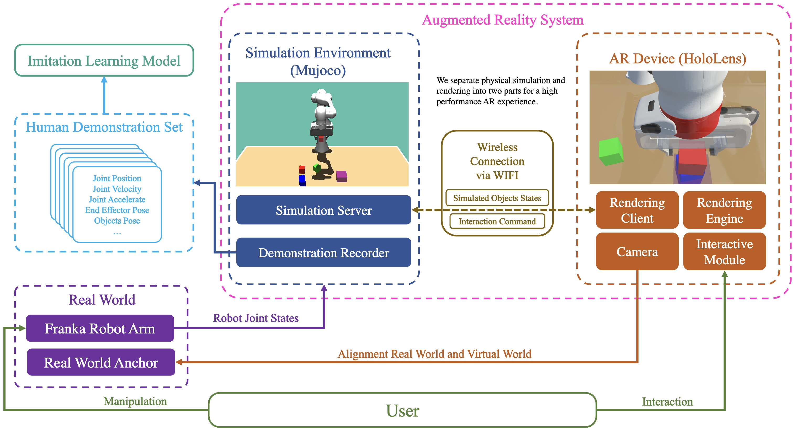

# HDAR-Simulator

## Introduction

This repo is used for creating human demonstrion from simulation.

Here is the main features:
- The simulated objects could be easily created or edited by json files.
- Optimaize the code to make sure all the recorded data is reproducable and always follow the timestamps.
- Flexible CLI to control the procedure of recording human demonstration.

The framework graph of this system is following:



[Paper Website](https://intuitive-robots.github.io/HDAR-Simulator/)

This application supports our paper ["A Comprehensive User Study on Augmented Reality-Based Data Collection Interfaces for Robot Learning"](https://intuitive-robots.github.io/HDAR-Simulator/), which was published on HRI2024. If you find our work useful, please consider citing.

```latex
@inproceedings{jiang2024comprehensive,
  title={A Comprehensive User Study on Augmented Reality-Based Data Collection Interfaces for Robot Learning},
  author={Jiang, Xinkai and Mattes, Paul and Jia, Xiaogang and Schreiber, Nicolas and Neumann, Gerhard and Lioutikov, Rudolf},
  booktitle={Proceedings of the 2024 ACM/IEEE International Conference on Human-Robot Interaction},
  pages={10},
  year={2024},
  organization={ACM},
  address={Boulder, CO, USA},
  date={March 11--14}
}
```

## Supported Simulation

- SimulationFramework (Mjbeta)

## Dependency

- SimPublisher